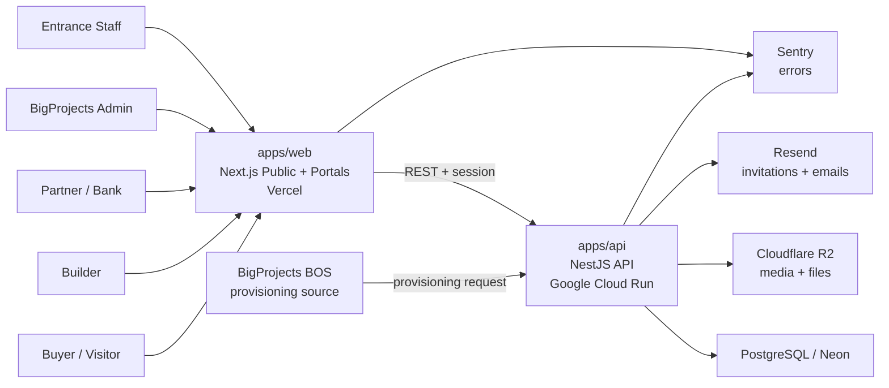
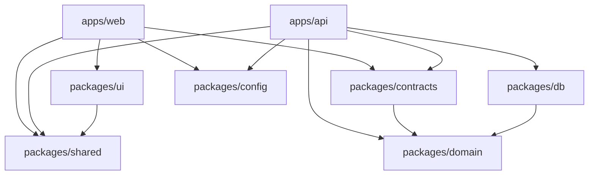
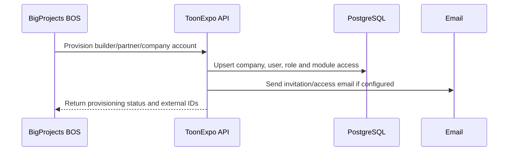
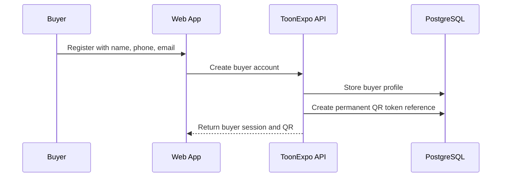
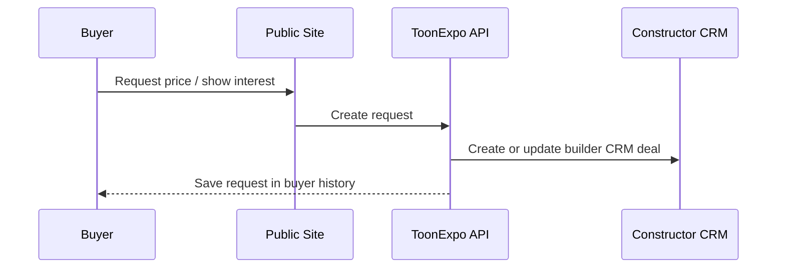
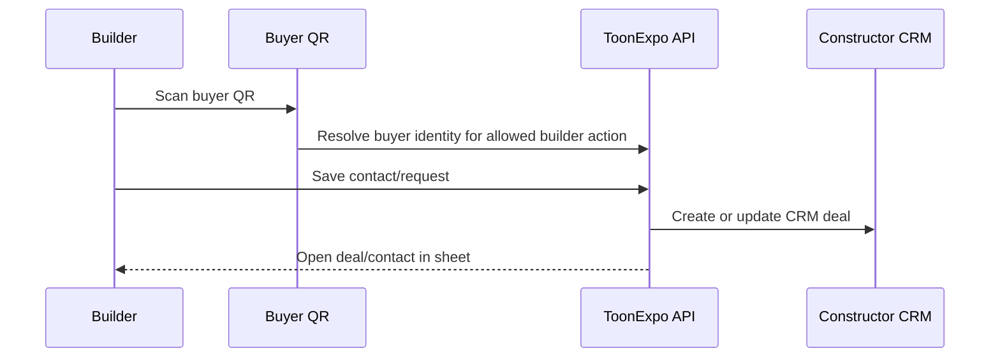
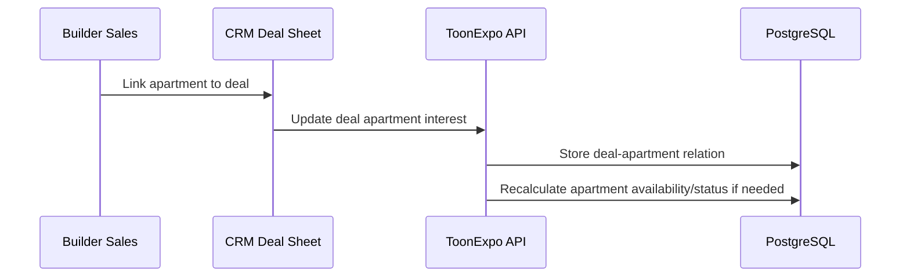

# ToonExpo Ecosystem - Technical Architecture

Public and private role-based platform for ToonExpo buyers, builders, partners, banks, BigProjects admins and entrance staff.

**Project size:** C - large  
**Architecture style:** modular monolith in a monorepo  
**Primary deployables:** `apps/web` and `apps/api`  
**Last updated:** 2026-07-17

**Backend isolation:** NestJS is the only backend. Next.js is frontend-only (typed client + `/nest` rewrite). Do not put Prisma, Auth.js, R2/Resend/Redis/BOS secrets, or product API routes in `apps/web`.

---

## 1. Architecture Thesis

ToonExpo Ecosystem is one product with several role experiences:

- public website and mobile-like buyer experience;
- buyer/visitor area with one permanent QR;
- builder portal with projects, apartments and Constructor CRM;
- partner and bank pages with mortgage offers;
- BigProjects admin workspace;
- entrance/check-in and exhibition map flows.

The correct architecture is a **modular monolith**:

- one ToonExpo product repository;
- one Next.js app for public pages and role-based portals;
- one NestJS API deployed as a container to Google Cloud Run;
- shared packages for domain logic, contracts, database, UI and config;
- strong ownership boundaries between public content, accounts, inventory, QR, CRM, readiness, partners and analytics.

This keeps the first version implementable while leaving enough structure for a large platform.

---

## 2. System Context



### Boundary

ToonExpo owns public/buyer/builder/partner/platform data. BOS owns internal sales, staff, event-cycle work and participant acquisition. The only required v1 integration is BOS provisioning accounts into ToonExpo.

---

## 3. Runtime Components

| Component | Path | Responsibility | Deployment |
|---|---|---|---|
| Web app | `apps/web` | Public website, buyer area, builder portal, admin portal, entrance UI | Vercel |
| API app | `apps/api` | Business logic, RBAC, QR, CRM, inventory, readiness, integrations | Google Cloud Run |
| Domain package | `packages/domain` | Framework-independent business rules, entities, value objects | bundled |
| Contracts package | `packages/contracts` | DTOs, Zod schemas, enums, API contracts | bundled |
| Database package | `packages/db` | Prisma schema, migrations, database client, persistence mapping | bundled |
| UI package | `packages/ui` | Shared UI primitives, sheets, cards, tables, map primitives | bundled |
| Shared package | `packages/shared` | Utilities, constants, logger interfaces, formatting helpers | bundled |
| Config package | `packages/config` | ESLint, TypeScript, Tailwind, Prettier and build config | bundled |

---

## 4. Monorepo Layout

```text
toonexpo-ecosystem/
  apps/
    web/
      src/
        app/                  # Next.js App Router, public and private routes
        features/             # feature UI by module
        components/           # app-level components
        i18n/                 # hy, ru, en routing/messages
        lib/                  # API client, auth helpers, config
      public/
    api/
      src/
        modules/              # NestJS domain modules
        common/               # guards, decorators, filters, interceptors
        integrations/         # BOS provisioning and optional external services
        main.ts
      Dockerfile              # Cloud Run container target
  packages/
    domain/                   # pure business logic
    contracts/                # schemas, DTOs, enums
    db/                       # Prisma schema/client/migrations
    ui/                       # reusable UI primitives
    shared/                   # utility helpers
    config/                   # shared tooling config
  docs/
  package.json
  pnpm-workspace.yaml
  turbo.json
```

The first implementation should create this skeleton before individual product modules are built.

---

## 5. Dependency Rules



Hard rules:

- `packages/domain` must not import Next.js, NestJS, Prisma, React or browser APIs.
- `packages/db` maps database records to domain concepts; it does not own business policy.
- `packages/contracts` owns shared request/response shapes and status enums.
- `apps/web` never imports Prisma, Auth.js/next-auth, argon2, or server secrets (`DATABASE_URL`, `AUTH_SECRET`, R2, Resend, Redis, BOS).
- `apps/web` must not host product REST under `app/api`; it calls Nest via `/nest/*` (same-origin rewrite) using `apps/web/src/lib/api/*`.
- `apps/api` is the only runtime that talks directly to the database and external services (auth sessions, uploads presign, email, rate limits, BOS).
- Thin `'use server'` wrappers in web may call Nest only — never Prisma.
- Cross-module imports go through public module exports, not deep internal paths.
- If historical docs conflict with these rules or `docs/TECH_CARD.md`, follow this file and TECH_CARD.

---

## 6. Product Modules

| Module | Owner / primary role | Core responsibility |
|---|---|---|
| Account & Access | Platform | Accounts, sessions, roles, company access and BOS provisioning |
| Public Web / Mobile App | Buyer/public | Public browsing, search, project pages and app-like mobile experience |
| Buyer / Visitor Area | Buyer | Profile, permanent QR, favorites, requests/interests and check-in status |
| Builder Portal | Builder | Company profile, team, inventory, media and builder workspace |
| Projects / Buildings / Floors / Apartments | Builder/Admin | Real-estate product catalog and apartment availability |
| Visual Map / Hotspots | Builder/Admin/Public | Image-based project navigation through building, floor and apartment layers |
| QR System | Buyer/Builder/Entrance | Permanent buyer QR, builder scan flow and entrance identification |
| CRM Lead Intake | Builder/Public | Converts public requests and QR scans into CRM deals |
| Constructor CRM | Builder | Builder sales pipeline, deal sheets, apartment links and client history |
| Builder Readiness | Admin/Builder | Quality scoring, checklist and service provider recommendations |
| Partners / Participants | Partner/Admin/Public | Partner profiles, bank extension and public partner pages |
| Exhibition Map & Check-in | Buyer/Admin/Entrance | Venue map, booths, search, route path and entrance scan flow |
| Admin / Content Management | BigProjects Admin | Full platform setup and global entity management |
| Analytics | Admin/Builder | Platform, event, builder and check-in metrics |
| Integrations | Platform | BOS provisioning and optional future service integrations |
| Mortgage / Bank Offers | Bank/Public | Mortgage calculator and bank-specific offer cards |
| Service Provider Directory | Admin/Builder | Service provider list used by readiness help flows |

Coming-soon modules may be documented, but v1 development must stay focused on the confirmed product flows.

---

## 7. Core Data Flows

### 7.1 BOS Provisioning Flow



Provisioning must be idempotent. Repeating the same BOS request must not create duplicate companies or users.

### 7.2 Buyer Registration And QR Flow



The QR token must not encode personal data directly. It identifies a registered account and opens allowed actions through the API.

### 7.3 Public Request To Constructor CRM



Requests and leads are not a separate workspace in v1. They feed Constructor CRM.

### 7.4 Builder QR Scan Flow



Both directions are valid: the buyer can request from the public site, or the builder can scan and create the interaction from the event floor.

### 7.5 Apartment Inventory And CRM Flow



Apartments are the concrete product inventory. CRM deals should be able to reference one or more apartments when sales work reaches that point.

---

## 8. Frontend Architecture

The frontend contains public pages and private role workspaces in one Next.js app.

### Route groups

```text
apps/web/src/app/
  [locale]/
    (public)/
      page.tsx
      projects/
      mortgage/
      partners/
      exhibition-map/
    (buyer)/
      account/
      qr/
      favorites/
      requests/
    (builder)/
      portal/
      crm/
      projects/
      readiness/
    (admin)/
      admin/
      companies/
      users/
      content/
      analytics/
    (entrance)/
      entrance/
```

### UI model

Private operational areas follow the BOS/NBOS style:

```text
workspace page -> card/row -> side sheet
linked entity   -> stacked sheet
short action    -> dialog or inline confirmation
```

Public and buyer mobile areas should feel app-like on mobile:

- bottom navigation or compact mobile shell where appropriate;
- fast search/filter for projects and apartments;
- QR available quickly after login;
- venue map usable on mobile during the event.

### Feature layout

```text
apps/web/src/features/
  account-access/
  public-site/
  buyer-area/
  builder-portal/
  inventory/
  visual-map/
  qr/
  crm-lead-intake/
  constructor-crm/
  readiness/
  partners/
  exhibition-map/
  admin/
  analytics/
  mortgage/
  service-providers/
```

Shared primitives belong in `packages/ui`. Product-specific screens stay in `apps/web/src/features`.

---

## 9. Backend Architecture

The API is a NestJS modular monolith. Each module owns controllers, services, persistence adapters, permissions and domain workflow orchestration.

```text
apps/api/src/modules/
  auth/
  users/
  companies/
  account-access/
  public-content/
  buyers/
  builders/
  partners/
  projects/
  buildings/
  floors/
  apartments/
  visual-maps/
  qr/
  lead-intake/
  constructor-crm/
  readiness/
  exhibition-map/
  mortgage/
  service-providers/
  analytics/
  integrations/
  audit-log/
```

Recommended internal module shape:

```text
modules/constructor-crm/
  constructor-crm.controller.ts
  constructor-crm.service.ts
  constructor-crm.repository.ts
  constructor-crm.permissions.ts
  constructor-crm.module.ts
```

API rules:

- REST endpoints grouped by module.
- OpenAPI/Swagger generated from controllers and DTOs.
- Request validation at the boundary.
- Role and company ownership checks before business mutations.
- Audit logs for admin actions, publication, provisioning, QR-sensitive actions and inventory status changes.
- No business workflow hidden in React components.

---

## 10. Data Architecture

ToonExpo data is company- and role-centered, with strong links to inventory and CRM.

Core entities:

| Entity | Purpose |
|---|---|
| User | Login identity for buyer, builder member, partner, admin or entrance staff |
| Company | Builder, partner, bank or service provider organization |
| CompanyMember | User role inside a company |
| BuyerProfile | Registered visitor profile with name, phone, email and QR |
| QrIdentity | Permanent QR token reference for a buyer |
| Project | Builder development/project |
| Building | Building inside a project |
| Floor | Floor plan/container inside a building |
| Apartment | Sellable inventory unit |
| VisualMapLayer | Image-based map layer for project/building/floor/apartment navigation |
| Hotspot | Clickable coordinate area on a visual map |
| LeadRequest | Incoming buyer interest/request source record |
| CrmDeal | Builder CRM deal generated from request or QR scan |
| CrmDealApartment | Relation between CRM deal and apartment(s) |
| ReadinessAssessment | Builder quality/readiness score |
| PartnerProfile | Public participant/partner profile |
| BankOffer | Bank mortgage offer used by calculator |
| VenueMap | Event map image and route graph |
| Booth | Builder/partner location on the event map |
| ServiceProvider | Directory entry used by readiness help |
| AnalyticsEvent | Platform, public, CRM, QR and event usage events |
| AuditLog | Admin/provisioning/security-sensitive action log |

Database implementation:

- PostgreSQL / Neon;
- Prisma migrations stored in `packages/db`;
- enums documented in `docs/02-ToonExpo-Ecosystem/04-Data/03-Status-Enums.md`;
- indexes on company, role, project, apartment status, CRM stage, QR identity, venue booth and publication status;
- no personal data encoded directly in QR tokens.

---

## 11. Integration Boundary With BOS

BOS is the source of truth for internal participant acquisition and event preparation.

ToonExpo is the source of truth for public platform accounts, projects, apartments, QR, builder CRM, buyer interactions and event navigation.

Required v1 integration:

```text
BOS approved participant
  -> ToonExpo provisioning endpoint
  -> ToonExpo creates company/user/module access
  -> ToonExpo returns status and external IDs
```

Not part of v1:

- sending all ToonExpo buyer data back to BOS;
- syncing builder CRM deals to BOS;
- duplicating BOS tasks or event cycle workflows inside ToonExpo;
- payment/ticket/e-commerce flows.

---

## 12. Public Website And Mobile UX

Public pages are part of the product, not a separate marketing shell.

Core public areas:

- home / event overview;
- project and apartment browsing;
- builder and partner pages;
- mortgage calculator and bank offers;
- venue/exhibition map;
- login/registration;
- buyer QR and buyer account.

Mobile priority:

- 60%+ usage is expected on mobile;
- registration and QR must be quick;
- project search and exhibition map must work comfortably on mobile;
- builder scan flow must be simple during the event.

---

## 13. Security Model

Security baseline:

- NestJS authentication with database sessions;
- httpOnly secure cookies;
- buyer self-registration only for buyer/visitor accounts;
- builder, partner, bank, admin and entrance accounts are provisioned by BigProjects Admin or BOS;
- role checks: BigProjects Admin, Builder, Partner, Buyer/Visitor, Entrance Staff;
- company ownership checks for builder and partner workspaces;
- input validation for every API mutation;
- rate limits on auth, QR, public request and provisioning endpoints;
- no secrets in frontend code;
- audit log for admin, provisioning, publication, QR-sensitive and inventory status changes.

QR rules:

- buyer gets one permanent QR after registration;
- QR token stores no personal data directly;
- scanning QR resolves through server-side permissions;
- builder scan creates/updates a CRM interaction only through allowed actions.

---

## 14. Deployment Architecture

| Environment | Web | API | Database | Purpose |
|---|---|---|---|---|
| Development | `localhost:3000` | `localhost:4000` | Local or Neon dev branch | Local development |
| Staging | Vercel preview/staging | Cloud Run staging service | Neon staging branch/db | Acceptance and QA |
| Production | ToonExpo production domain | Cloud Run production service | Neon production db | Live platform |

Infrastructure:

- Vercel hosts `apps/web`;
- Google Cloud Run hosts `apps/api`;
- Neon/PostgreSQL stores relational data;
- Cloudflare R2 stores media, maps and attachments;
- Resend sends account invitations and emails if enabled;
- Sentry tracks runtime errors;
- GitHub Actions runs lint, typecheck, tests and builds.

Cloud Run should receive a Docker image built from `apps/api/Dockerfile`. Runtime configuration comes from environment variables and Google Secret Manager or the chosen secret source.

---

## 15. Scaling Strategy

Expected v1 load is moderate, with spikes around event days. Optimize for correctness, mobile UX and clean module boundaries first.

Scale path:

1. Keep the modular monolith.
2. Add database indexes based on real slow queries.
3. Add Upstash Redis only when caching, queues, rate-limit storage or multi-instance coordination become necessary (prefer Upstash over self-hosted Redis).
4. Move heavy background work into a worker only when a real workload appears.
5. Keep QR, provisioning and request creation idempotent so retries are safe.
6. Consider dedicated search only if PostgreSQL search becomes insufficient.

---

## 16. Key Decisions

| Decision | Choice | Reason |
|---|---|---|
| Product split | ToonExpo separate from BOS | Different users, lifecycle and data ownership |
| Architecture | Modular monolith | Large enough for structure, not complex enough for microservices |
| Repo layout | `apps/*` and `packages/*` | Fits Size C and shared contracts/UI |
| Frontend | Next.js App Router | Public pages and private portals in one app |
| Backend | NestJS | Modules, guards, validation and OpenAPI |
| API style | REST + OpenAPI | Clear for web app and BOS integration |
| Database | PostgreSQL + Prisma | Inventory, CRM and role data are relational |
| API hosting | Google Cloud Run | Containerized NestJS runtime |
| Web hosting | Vercel | Best fit for Next.js |
| Integration | Minimal BOS -> ToonExpo provisioning | Avoids duplicate ownership |
| QR privacy | Token reference only | No personal data encoded in QR |
| Marketplace name | Service Provider Directory | It is a curated services list, not ecommerce |

---

## 17. Implementation Guardrails

- Do not create self-registration for builders, partners, banks or admins in v1.
- Do not split Requests/Leads from CRM as a separate workspace; intake feeds Constructor CRM.
- Do not encode personal data in QR.
- Do not sync all ToonExpo data back to BOS.
- Do not build payments, tickets or ecommerce in v1.
- Do not make media a separate product module unless it becomes a true asset library later.
- Every module must have docs, entity fields and acceptance criteria before deep implementation.

---

## 18. Related Documents

- [Tech Card](./TECH_CARD.md)
- [Development Start Pack](./00-Development-Start/01-MVP-Scope-Freeze.md)
- [Dependency Graph](./architecture/DEPENDENCY_GRAPH.md)
- [BOS / ToonExpo Boundary](./03-Integration-With-BOS/01-BOS-ToonExpo-Boundary.md)
- [Integration Contracts](./03-Integration-With-BOS/03-Integration-Contracts.md)
- [Decisions](./DECISIONS.md)
