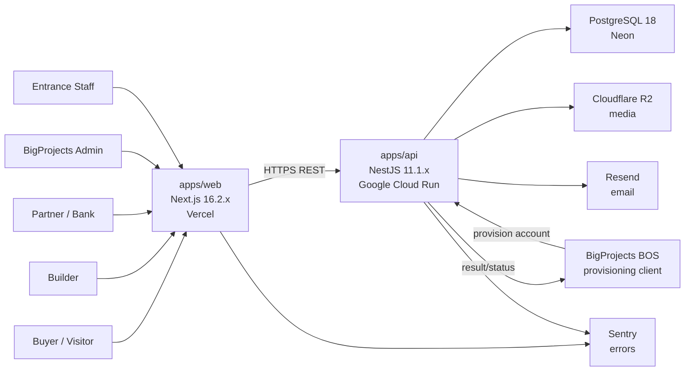
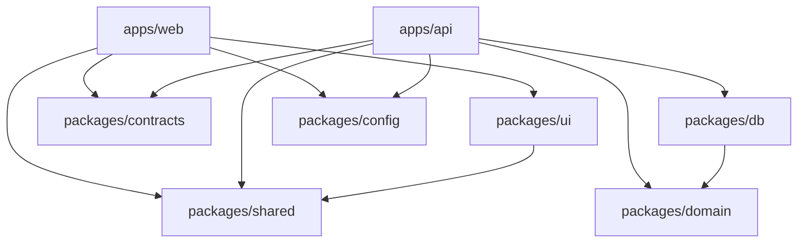
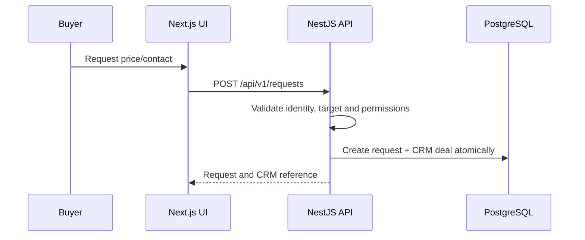
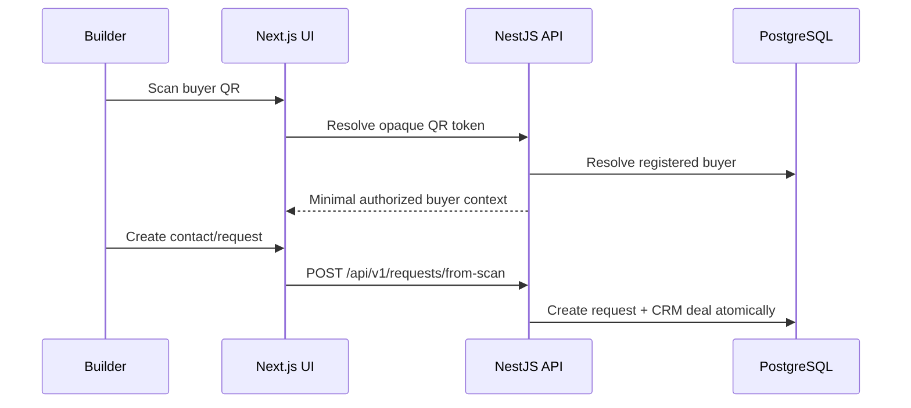
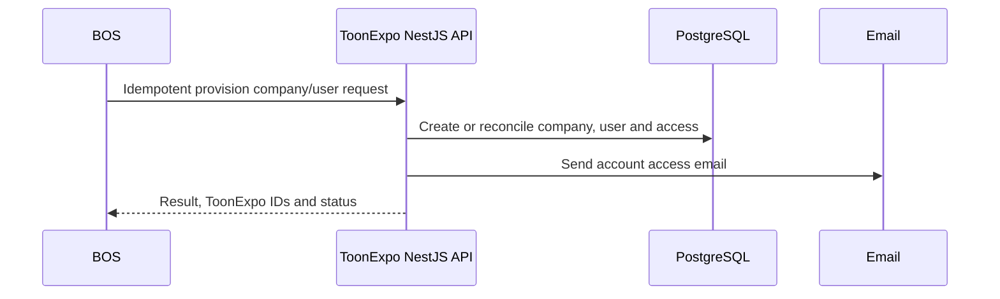

# ToonExpo Ecosystem - Technical Architecture

Public and role-based digital platform for ToonExpo buyers, builders, partners, BigProjects admins and entrance staff. The product includes real-estate presentation, inventory, CRM, QR, readiness, partner offers and event navigation.

**Project size:** C - large
**Architecture style:** modular monolith in a monorepo
**Primary deployables:** `apps/web` and `apps/api`
**Last updated:** 2026-07-17

---

## 1. Architecture Thesis

ToonExpo is one product with multiple role-based experiences. It should be implemented as a modular monolith:

- one product repository;
- one Next.js frontend containing public and authenticated UI surfaces;
- one NestJS backend containing the complete product API and business logic;
- one PostgreSQL database with explicit module ownership;
- shared packages for contracts, domain rules, database, UI and tooling;
- strict boundaries between inventory, CRM, QR, maps, readiness, partners and administration.

This keeps deployment and transactions manageable while preserving module boundaries suitable for a large, long-lived product. Microservices are not justified at the current scale.

ToonExpo is a full production product, not an MVP or prototype. Delivery may be incremental, but included modules must be production-ready and complete for their approved release scope.

### Authoritative runtime boundary

```text
Browser -> Next.js frontend -> NestJS REST API -> Prisma -> PostgreSQL
```

`apps/web` is not a backend. It must not contain product API routes, product mutations in Server Actions, Prisma imports, direct database access or authoritative business rules. All backend behavior belongs to `apps/api`. See [Frontend / Backend Boundary](./architecture/FRONTEND_BACKEND_BOUNDARY.md).

---

## 2. System Context



### Product ownership boundary

ToonExpo owns public content, accounts, builder and partner organizations, project/apartment inventory, buyer QR, requests, Constructor CRM, readiness, event maps/check-in and analytics.

BigProjects BOS owns internal participant acquisition, internal deals, onboarding checklists, staff tasks and KPI. The systems exchange only account provisioning data required to activate an approved participant.

---

## 3. Runtime Components

| Component | Path | Responsibility | Deployment |
|---|---|---|---|
| Web app | `apps/web` | Public pages and role-based frontend experiences | Vercel |
| API app | `apps/api` | Complete backend: auth, RBAC, workflows, persistence and integrations | Google Cloud Run |
| Domain package | `packages/domain` | Small shared kernel for cross-module value objects only | Bundled into API |
| Contracts package | `packages/contracts` | Framework-neutral enums/schemas and generated API client support | Bundled |
| Database package | `packages/db` | Prisma schema, migrations, generated client and persistence support | API runtime only |
| UI package | `packages/ui` | Reusable visual primitives and design tokens | Bundled into web |
| Shared package | `packages/shared` | Environment-neutral utilities and types | Bundled |
| Config package | `packages/config` | Shared TypeScript, lint, Tailwind and build config | Build time |

---

## 4. Monorepo Layout

```text
toonexpo-ecosystem/
  apps/
    web/
      src/
        app/                    # Next.js routes/layouts only
        features/               # role and product UI features
        components/             # app-level components
        lib/                    # typed NestJS API client, i18n, UI auth state
      public/
    api/
      src/
        modules/                # NestJS product modules
        common/                 # guards, filters, interceptors, decorators
        integrations/           # BOS, R2 and email adapters
        main.ts
      Dockerfile                # Cloud Run image target
  packages/
    domain/                     # small shared kernel; feature domains stay in API modules
    contracts/                  # neutral contracts and generated client support
    db/                         # Prisma schema/client/migrations; API runtime only
    ui/                         # shared React components
    shared/                     # neutral utilities
    config/                     # shared tooling config
  docs/
  package.json
  pnpm-workspace.yaml
  turbo.json
```

The repository skeleton, linted dependency boundaries and both deployables must exist before product modules are implemented.

---

## 5. Dependency Rules



Hard rules:

- `apps/web` cannot import `packages/db` or `packages/domain`.
- `apps/api` is the only runtime allowed to import Prisma Client.
- `packages/domain` is a small shared kernel, not a global home for all business logic; it cannot import Next.js, React, NestJS or Prisma.
- Feature-specific domain rules live in `apps/api/src/modules/<module>/domain`.
- `packages/ui` cannot import server secrets, database code or backend modules.
- NestJS OpenAPI is the canonical HTTP contract; frontend types are generated from or checked against it.
- Product endpoints cannot be implemented in Next.js route handlers.
- Product mutations cannot be implemented as Next.js Server Actions.
- Cross-module access goes through an owning module's public application API, not deep imports.

The boundary should be enforced in ESLint/CI, not left as documentation only.

---

## 6. Product Modules

| Backend module | Core ownership |
|---|---|
| Accounts & Access | Registration, provisioned accounts, sessions, roles, company membership |
| Companies | Builder, partner and bank organizations and members |
| Catalog | Projects, buildings, floors, apartments, statuses and publication |
| Media & Visual Maps | Media metadata, image maps, hotspots and 3D links |
| Buyer | Buyer profile, favorites, requests and permanent QR identity |
| Lead Intake | Normalizes buyer-created and builder-created contact requests |
| Constructor CRM | Builder pipeline, deal stages, notes, follow-up activities and apartment links |
| Readiness | Assessments, categories, scores and recommendations |
| Partners & Mortgage | Partner profiles, bank offers and calculator inputs |
| Service Providers | Categorized provider directory connected to readiness help |
| Events | Event records, venue maps, booths, routes and check-in |
| Content | Public content blocks, translations and publication controls |
| Analytics | Product/event measurements and role-scoped summaries |
| Provisioning | Idempotent BOS account/company provisioning contract |
| Audit | Security and business-critical mutation history |

Frontend features mirror user workflows, not persistence tables. A single backend module may serve several frontend areas.

---

## 7. Frontend Architecture

`apps/web` contains five experiences in one Next.js application:

- public website;
- buyer/visitor area;
- builder portal;
- partner area where required;
- BigProjects admin and entrance staff interfaces.

Recommended route groups:

```text
apps/web/src/app/
  [locale]/
    (public)/
    (buyer)/
    (builder)/
    (partner)/
    (admin)/
    (entrance)/
```

Recommended feature layout:

```text
apps/web/src/features/
  accounts/
  catalog/
  buyer/
  crm/
  readiness/
  partners/
  event-map/
  check-in/
  admin-content/
```

Frontend rules:

- Server Components render initial API data where appropriate.
- Client Components handle browser interaction and realtime-like local updates.
- Both use a typed client for the NestJS API; neither queries PostgreSQL.
- React Hook Form/Zod improves frontend feedback; NestJS performs authoritative validation again.
- Next.js redirects/proxy can improve navigation, but NestJS guards enforce access.
- Public pages use suitable SSG/ISR/SSR behavior based on freshness; authenticated pages avoid shared user-data caches.
- Public and buyer UX is mobile-first and app-like; operational portals use page/card/sheet patterns.

---

## 8. Backend Architecture

`apps/api` is the complete product backend. It is a NestJS modular monolith deployed independently from Next.js.

```text
apps/api/src/modules/
  auth/
  users/
  companies/
  catalog/
  media/
  visual-maps/
  buyers/
  qr/
  lead-intake/
  crm/
  readiness/
  partners/
  mortgage/
  service-providers/
  events/
  check-in/
  content/
  analytics/
  provisioning/
  audit/
```

Recommended internal module shape:

```text
modules/catalog/
  presentation/
    catalog.controller.ts
    dto/
  application/
    commands/
    queries/
    catalog.service.ts
  domain/
    policies/
    errors/
  infrastructure/
    prisma-catalog.repository.ts
  catalog.module.ts
```

Backend rules:

- Controllers map HTTP and invoke application services; they do not contain workflow logic.
- Application services coordinate use cases and transactions.
- Domain policies hold rules independent of HTTP and Prisma.
- Infrastructure adapters own Prisma, R2, Resend and BOS implementation details.
- NestJS guards/policies enforce role, company and resource ownership.
- A global validation pipe rejects invalid body, params and query data.
- A global exception filter maps stable domain/application codes to safe HTTP responses.
- Important mutations produce audit events with actor, target and request ID.
- All public and private endpoints are documented through OpenAPI.

---

## 9. Data Architecture

PostgreSQL 18 on Neon is the source of truth. Prisma ORM 7 schema, migrations and generated client live in `packages/db`; only NestJS imports the runtime client.

Major aggregates:

| Aggregate | Important entities |
|---|---|
| Identity | User, BuyerProfile, CompanyMember, ModuleAccess, Session/RefreshToken |
| Organization | Company, BuilderCompany, PartnerCompany |
| Catalog | Project, Building, Floor, Apartment, ApartmentStatusHistory |
| Presentation | MediaAsset, VisualMapCanvas, VisualHotspot, Translation |
| Buyer engagement | Request, Favorite, QrCode, QrScanEvent |
| CRM | CrmDeal, CrmDealApartmentLink, CrmNote, CrmFollowUpActivity |
| Readiness | Assessment, Category, Score, Recommendation |
| Partner | BankOffer, ServiceProvider, ServiceProviderCategory |
| Event | Event, VenueMap, Booth, BoothAssignment, RouteNode, RouteEdge, CheckInRecord |
| Operations | ProvisioningRequest, AnalyticsEvent, AuditLog |

Data rules:

- Apartment is the primary sellable inventory unit.
- CRM stages that represent reservation/sale require apartment linkage according to module rules.
- Buyer has one permanent QR identity; the encoded value is an opaque lookup token.
- Builder/partner/bank accounts are provisioned, not publicly self-registered.
- Public content uses explicit draft/published/archived publication state.
- Foreign keys, ownership keys, status/time filters and public slugs require indexes.
- Multi-entity writes use database transactions.
- Migrations run once through CI/deployment tooling, never during Next.js build or request handling.

---

## 10. Core Data Flows

### Buyer-created request



### Builder scans buyer QR



Both flows create the same canonical request/CRM structures. The initiating device changes, not the business model.

### BOS provisioning



---

## 11. API And Contract Strategy

- Base prefix: `/api/v1`.
- NestJS controllers and DTOs generate canonical OpenAPI.
- Frontend client/types are generated from or validated against OpenAPI in CI.
- Stable error payloads include `code`, `message`, `requestId` and field errors where applicable.
- Cursor pagination is preferred for large activity/CRM lists; bounded page pagination is acceptable for admin catalogs.
- Idempotency keys are required for BOS provisioning and other retry-sensitive create operations.
- No API contract is defined only inside a React component or Next.js route handler.

---

## 12. Authentication And Authorization

Authentication is owned by NestJS, using Passport and a confirmed secure backend session/token strategy.

Baseline:

- buyer self-registration with name, phone and email;
- builder, partner, bank and staff accounts created by admin or BOS provisioning;
- argon2id for stored passwords;
- secure httpOnly cookies for browser credentials;
- explicit CORS allowlist and CSRF protection for cookie-authenticated mutations;
- NestJS guards for role checks;
- policy checks for company and resource ownership;
- rate limits for auth, QR resolution, public requests and provisioning;
- no authorization based only on hidden UI or Next.js redirect logic.

---

## 13. Deployment Architecture

| Environment | Web | API | Database | Purpose |
|---|---|---|---|---|
| Development | `localhost:3000` | `localhost:4000` | Local or Neon dev branch | Local development |
| Staging | Vercel staging | Cloud Run staging service | Neon staging branch/database | QA and acceptance |
| Production | ToonExpo domain on Vercel | Cloud Run production service | Neon production database | Live product |

Infrastructure responsibilities:

- Vercel builds and hosts only `apps/web`.
- Google Cloud Run runs the `apps/api` Docker image.
- Neon hosts PostgreSQL 18 and production recovery capabilities.
- Cloudflare R2 stores media; PostgreSQL stores metadata and ownership.
- GitHub Actions runs lint, typecheck, tests, both builds, contract checks and one migration job.
- Google Secret Manager or an approved secret store supplies Cloud Run secrets.
- Sentry and structured Cloud Run logs provide error and request visibility.

---

## 14. Scaling And Reliability

1. Keep the modular monolith while module boundaries remain healthy.
2. Scale Next.js and Cloud Run independently.
3. Add indexes and query improvements based on measured production behavior.
4. Add Redis only for concrete caching, distributed rate limit or queue requirements.
5. Introduce workers for measured background workloads without moving domain ownership.
6. Extract a service only when scaling, isolation or team ownership clearly requires it.

All external calls require timeouts. Retry only transient, idempotent operations with bounded backoff. Cloud Run must provide lightweight liveness/readiness endpoints and graceful shutdown.

---

## 15. Implementation Guardrails

- Do not put Prisma, PostgreSQL access or product API routes in Next.js.
- Do not implement product mutations in Server Actions.
- Do not duplicate authorization between runtimes; NestJS is authoritative.
- Do not split requests and Constructor CRM into competing data models.
- Do not encode personal data in QR values.
- Do not treat Service Provider Directory as ecommerce or a marketplace engine.
- Do not broadly synchronize ToonExpo operational data into BOS.
- Do not introduce microservices, queues or realtime infrastructure without a documented requirement.
- Do not call an incomplete prototype an MVP; implement the approved production scope with full quality gates.

---

## 16. Related Documents

- [Tech Card](./TECH_CARD.md)
- [Production Scope](./00-Development-Start/01-Production-Scope.md)
- [Dependency Graph](./architecture/DEPENDENCY_GRAPH.md)
- [Frontend / Backend Boundary](./architecture/FRONTEND_BACKEND_BOUNDARY.md)
- [BOS / ToonExpo Boundary](./03-Integration-With-BOS/01-BOS-ToonExpo-Boundary.md)
- [Integration Contracts](./03-Integration-With-BOS/03-Integration-Contracts.md)
- [Decisions](./DECISIONS.md)
