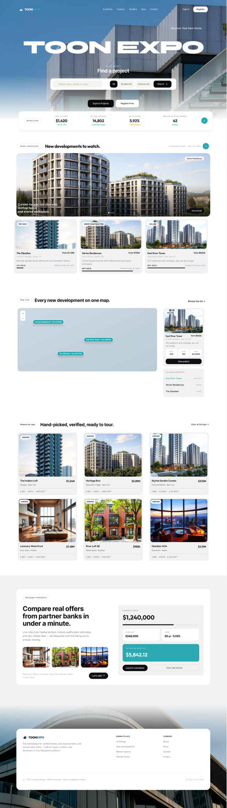
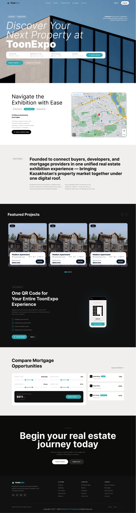
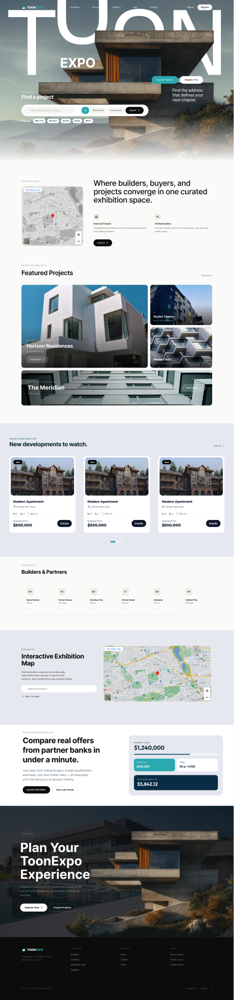

# ToonExpo Design Style Variants

## Status

- **Design variant:** **Variant A selected** — confirmed by the product owner on 2026-07-18.
- **Style baseline:** Shared Style Baseline remains valid; Variant A tokens (clean white/gray surfaces, large display typography) are now the canonical direction for public pages.

Use Variant A (node 1:2) as the reference for public marketing/catalog UI. Variants B and C are kept below for historical reference only.

## Source

Figma file: [ToonExpo design variants](https://www.figma.com/design/XQY5FCMinniQCN6aFoyS2G)

| Variant | Figma node | Screenshot |
|---------|------------|------------|
| A — Home 01 | [1:2](https://www.figma.com/design/XQY5FCMinniQCN6aFoyS2G?node-id=1-2) | [design-variant-a.png](./assets/design-variant-a.png) |
| B — Home 02 | [1:640](https://www.figma.com/design/XQY5FCMinniQCN6aFoyS2G?node-id=1-640) | [design-variant-b.png](./assets/design-variant-b.png) |
| C — Home 03 | [1:1305](https://www.figma.com/design/XQY5FCMinniQCN6aFoyS2G?node-id=1-1305) | [design-variant-c.png](./assets/design-variant-c.png) |

Extracted via Figma MCP (`get_design_context`, `get_screenshot`, `get_variable_defs`) on 2026-07-18.

---

## Variant A — Home 01



### Mood

Light, premium PropTech marketplace. White-dominant layout, architectural photography, soft gray surfaces, teal accent. Minimal dark-mode usage; contrast comes from black CTAs and hero typography over imagery.

### Color palette

| Token | Hex | Usage |
|-------|-----|-------|
| Brand primary | `#2BA8B0` | Primary buttons, map pins, accent links, calculator highlight blocks |
| Brand secondary | `#2A667B` | “EXPO” wordmark accent (footer) |
| Background | `#FFFFFF` | Page canvas |
| Surface muted | `#F1F1F2` | Cards, map sidebar, section bands |
| Surface input | `#F5F4F1` | Search chips, inactive filter pills |
| Text primary | `#0D0E12` / `#0C0C0B` | Headings, body emphasis |
| Text secondary | `#6B7280` | Descriptions |
| Text muted | `#9CA3AF` | Labels, metadata, uppercase captions |
| Text label | `#4B5563` | Pill tags, secondary buttons |
| Border | `#E5E9F2` / `#D1D5DB` | Dividers, outlines, pill borders |
| Map canvas | `#D8E2EC` | Map placeholder background |
| Success | `#00BC7D` | Positive stat deltas |

### Typography

| Role | Font | Size / weight | Notes |
|------|------|---------------|-------|
| Hero display | BBH Bartle | 108px Regular | “Toon Expo” watermark headline |
| Section H2 | Inter | 28–42px Bold | tracking −0.7px to −1.05px |
| Card title | Outfit | 14–15px SemiBold | Property names |
| Stat / price | Outfit | 24–38px Bold | Numeric emphasis |
| UI body | Inter | 13–15px Regular / Medium | Default copy |
| Caption | Inter | 8–12px Bold / Medium | Uppercase labels, tracking 0.25–1px |

Line heights cluster around 1.45–1.5 for body; tight negative tracking on large headings.

### Radii, shadows, spacing

| Token | Value |
|-------|-------|
| Radius pill | Full (9999px) — tags, primary CTAs, map markers |
| Radius lg | 24px — hero cards, footer container, mortgage panel |
| Radius md | 16px — listing cards, map frame, image groups |
| Radius sm | 14px — inner images, inputs, hero buttons |
| Radius xs | 10px — zoom controls, stat tiles |
| Shadow card | `0 11px 7px rgba(69,85,108,0.07)` — floating stats bar |
| Shadow control | `0 1px 3px rgba(0,0,0,0.1), 0 1px 2px -1px rgba(0,0,0,0.1)` |
| Shadow map pin | `0 10px 7.5px rgba(0,0,0,0.1), 0 4px 3px rgba(0,0,0,0.1)` |
| Content max width | 1280px |
| Section padding | 24–40px horizontal; 32–40px vertical |
| Grid gap | 12–16px common; 28px nav link spacing |

### Key components

- **Navigation:** Transparent over hero; logo `TOON` + teal `EXPO`; 13px Inter links; ghost Sign In + white Register (`rounded 14px`).
- **Hero search:** White rounded container (~14px); segmented filters on `#F5F4F1`; teal “All” chip; black Search CTA.
- **Buttons:** Teal filled pill; black filled pill (`#0D0E12`); white filled with dark text; outline gray border for tertiary.
- **Cards:** `#F1F1F2` shell, 16px radius, 14px image radius, white stat tiles, black full-width card CTA (34px height).
- **Inputs:** Bordered white panels; placeholder grays; calculator fields on white with `#E5E9F2` border, 14px radius.
- **Tags:** Semi-transparent white pills with border; uppercase 10px labels.

---

## Variant B — Home 02



### Mood

Editorial real-estate landing with **light/dark rhythm**. Full-bleed hero photo, large mixed-weight headline, alternating black sections (featured projects, footer). Feels corporate and exhibition-focused.

### Color palette

| Token | Hex | Usage |
|-------|-----|-------|
| Brand primary | `#2BA8B0` | CTAs, active chips, step indicators, sliders |
| Brand secondary | `#2A667B` | Header logo “EXPO” |
| Background | `#FFFFFF` | Main sections |
| Surface dark | `#000000` / `#0F172B` | Featured band, card CTAs, footer |
| Text on dark | `#FFFFFF` / `rgba(255,255,255,0.75)` | Hero nav, headlines |
| Text primary | `#0F172B` | Card titles (Montserrat) |
| Text secondary | `#45556C` | Card metadata |
| Text on light | `#040E16` | Register label |
| Border / map frame | `#F0EFED` | Map widget (5px border) |
| Hero overlay | `rgba(15,23,43,0.6)` | Card image gradient |

### Typography

| Role | Font | Size / weight | Notes |
|------|------|---------------|-------|
| Hero headline | Inter | 108px Light Italic + Black | Mixed-weight hero sentence |
| Section H2 | Inter | 58px Regular | Split editorial blocks |
| Subsection H3 | Inter | 16px Bold | Feature callouts |
| Card title | Montserrat | 20px Bold | Featured property cards |
| Card meta | Montserrat | 14px Regular | Location, specs |
| UI body | Inter | 13–14px Regular / SemiBold | Nav, forms, lists |
| Label | Inter | 14px SemiBold uppercase | Search field labels, tracking 1px |

Figma variables on map widget (shared with C): `radius-s: 4px`, `spacing-4px`, `spacing-12px`, `Text 3: Inter 12px Regular`, `Shadow/Light/S: 0 4px 20px rgba(0,0,0,0.1)`.

### Radii, shadows, spacing

| Token | Value |
|-------|-------|
| Radius pill | Full — primary/secondary buttons, chips, QR steps |
| Radius hero search | 20px |
| Radius card | 16px outer; 20px inner detail panel |
| Radius card CTA | 30px |
| Radius map | 26px |
| Radius control | 4px (`radius-s`) — map controls |
| Shadow featured badge | `0 10px 7.5px rgba(0,0,0,0.1), 0 4px 3px rgba(0,0,0,0.1)` |
| Shadow carousel nav | `0 10px 15px rgba(0,0,0,0.1), 0 4px 6px rgba(0,0,0,0.1)` |
| Content max width | 1280px (95–83px side margins) |
| Hero height | ~897px |

### Key components

- **Navigation:** Fixed header on hero; Outfit/Inter logo; centered links; white Register pill.
- **Hero search:** Large white bar (20px radius); four labeled columns; teal “Search Homes” pill (44px height).
- **Buttons:** Teal pill primary; glass/outline secondary (`backdrop-blur`, white 10% fill); black pill on cards (`#0F172B`, 30px radius).
- **Cards:** Full-bleed image, floating white detail sheet (20px radius), Montserrat typography, dark “Details” button.
- **Chips:** Outline default; filled teal for active (“Top Developers”, “Mortgage Ready”).
- **Dark sections:** Black background carousel; white text; teal step circles with border for QR flow.

---

## Variant C — Home 03



### Mood

Warm luxury editorial. Off-white `#FAFAF8` canvas, oversized “TOON” watermark, generous whitespace, soft warm neutrals. Most aspirational and residential-lifestyle oriented of the three.

### Color palette

| Token | Hex | Usage |
|-------|-----|-------|
| Brand primary | `#2BA8B0` | Logo accent, primary buttons, active search tab |
| Background | `#FAFAF8` | Page and gradient fade |
| Surface warm | `#F5F4F1` | Input backgrounds, inactive pills |
| Surface icon | `#EDEAE4` | Feature icon tiles |
| Surface border | `#F0EFED` | Map frame |
| Text primary | `#0C0C0B` | Headings, buttons on white |
| Text chip | `#0B2230` | Quick-filter pills on hero |
| Text secondary | `#6B6663` | Body, inactive controls |
| Text placeholder | `#9B9790` | Search placeholder |
| CTA dark | `#0C0C0B` | Search submit, section buttons |
| Link (map) | `#0369F0` | Map control text (system) |

### Typography

| Role | Font | Size / weight | Notes |
|------|------|---------------|-------|
| Hero watermark | Inter | 82px Bold | City/location headline |
| Hero tagline | Inter | 26–32px Regular | Right-column editorial copy |
| Section H2 | Inter | 40–48px Medium / SemiBold | tracking −1px to −1.2px |
| Logo | Outfit | 18px ExtraBold | `TOON` + teal `EXPO` |
| UI body | Inter | 13px Regular / Medium | Nav, forms |
| Overline | Inter | 10px Regular uppercase | tracking 2px |

### Radii, shadows, spacing

| Token | Value |
|-------|-------|
| Radius pill | Full — nav Register, section CTAs, filter chips |
| Radius search shell | 60px outer; 44px inner segments; 20px active tab |
| Radius card / map | 16px images; 26px map widget |
| Radius icon tile | 10px |
| Shadow | Same Figma `Shadow/Light/S` token as Variant B |
| Content max width | 1280px, 40px horizontal padding |
| Nav link gap | 78px (wide editorial spacing) |

### Key components

- **Navigation:** White Register pill; 13px ghost links on photography.
- **Hero:** Quick-filter white pills (`#0B2230` text); dual CTAs (teal outline + white); mega search bar with segmented mode toggles.
- **Buttons:** Teal pill; white pill with dark text; black pill for primary search action.
- **Cards:** Image-first, minimal chrome, warm gray metadata.
- **Feature rows:** 36px `#EDEAE4` icon squares + 13px semibold titles.
- **Map:** Shared widget pattern — 26px frame, `#F0EFED` border, 4px control radius.

---

## Shared Style Baseline

Use these tokens in code **now**, regardless of which homepage variant wins.

### Palette (interim)

```text
brand-primary:     #2BA8B0
brand-secondary:   #2A667B   (wordmark accent — optional until final logo treatment)
background:        #FFFFFF   (admin/portals may use #FAFAF8 where warm tone fits)
surface-muted:     #F1F1F2   (or #F5F4F1 for warmer contexts)
text-primary:      #0D0E12   (accept #0C0C0B as alias)
text-secondary:    #6B7280   (accept #6B6663 in warm contexts)
text-muted:        #9CA3AF
border-default:    #E5E9F2
border-strong:     #D1D5DB
cta-dark:          #0D0E12
success:           #00BC7D
on-dark:           #FFFFFF
```

### Typography (interim)

```text
font-ui:           Inter (400, 500, 600, 700)
font-brand:        Outfit (600–800) — logos, prices, key numerics
font-display:      TBD — BBH Bartle (A) vs large Inter (B/C); do not ship display face until variant is chosen

scale-caption:     10–12px / uppercase / tracking 0.25–2px
scale-body:        13–15px / line-height ~1.45
scale-heading-sm:  28–32px / bold / negative tracking
scale-heading-lg:  40–48px / bold or semibold
scale-display:     82–108px / reserved for marketing hero only
```

### Radii (interim)

```text
radius-pill:   9999px
radius-xs:     4px    (controls — from Figma variable radius-s)
radius-sm:     10–14px
radius-md:     16px   (cards — default)
radius-lg:     20–24px (panels, footer)
radius-xl:     26px   (map embeds)
radius-search: defer — 14px (A), 20px (B), 60px (C) until final variant
```

### Shadows (interim)

```text
shadow-sm:   0 1px 3px rgba(0,0,0,0.1), 0 1px 2px -1px rgba(0,0,0,0.1)
shadow-md:   0 4px 20px rgba(0,0,0,0.1)          (Figma Shadow/Light/S)
shadow-lg:   0 10px 15px rgba(0,0,0,0.1), 0 4px 6px rgba(0,0,0,0.1)
shadow-pin:  0 10px 7.5px rgba(0,0,0,0.1), 0 4px 3px rgba(0,0,0,0.1)
```

### Spacing & layout (interim)

```text
content-max-width:  1280px
gutter:             24px (mobile) → 40px (desktop)
section-y:          32–112px between major blocks
grid-gap:           12px (tight) | 16px (default) | 32px (sections)
spacing-4:          4px   (Figma variable)
spacing-12:         12px  (Figma variable)
```

### Component patterns (interim)

| Component | Baseline rule |
|-----------|---------------|
| Primary button | Teal `#2BA8B0` fill, white text, pill radius, 13–14px Inter Medium |
| Secondary button | Dark `#0D0E12` fill OR white fill with dark text |
| Ghost button | Text-only or 1px border `#D1D5DB` / rgba white on imagery |
| Card | 16px radius, image top, muted label + semibold title, optional black/teal CTA |
| Input | Light gray or white fill, 10–14px radius, 13px Inter, muted placeholder |
| Nav | Logo left, links center/right, Sign In ghost + Register filled white |
| Tag / chip | Pill, uppercase optional, border or light fill |
| Map block | Rounded 16–26px, teal markers, optional sidebar listing card |

### Tone

- **Theme:** Light-first premium real estate / PropTech.
- **Density:** Airy — photography and headings breathe; data-dense areas use cards and pills.
- **Photography:** Hero and listing imagery carry the brand; UI stays quiet neutrals + teal.
- **Trust cues:** “Verified”, stats, maps, mortgage calculator — consistent across variants.

---

## Differences (decide with product owner)

| Dimension | A | B | C |
|-----------|---|---|---|
| Page background | Pure white + gray bands | White + **black sections** | Warm `#FAFAF8` |
| Hero display type | **BBH Bartle** 108px | Inter 108px mixed italic/bold | Inter 82px + TOON watermark |
| Hero search shape | Compact, 14px corners | Wide labeled bar, 20px | **Mega pill** 60px shell |
| Button default radius | 14px rects + pills | Mostly pills | Mostly pills |
| Card typography | Inter + **Outfit** | **Montserrat** on featured cards | Inter + Outfit |
| Section rhythm | Light throughout | **Alternating dark bands** | Warm editorial spacing |
| Logo EXPO color | Teal on hero / `#2A667B` in footer | `#2A667B` in header | Teal on hero |
| Emotional tone | Marketplace / data-rich | Corporate exhibition | Luxury lifestyle |

---

## Open Decision

**Owner action required:** select **Variant A**, **B**, or **C** (or a hybrid) as the single public marketing direction.

Until then:

1. Implement **Shared Style Baseline** tokens only in shared theme/CSS.
2. Do not lock display typography, search bar shape, dark-section layout, or warm-vs-cool neutrals globally.
3. After selection: update this document’s Status, remove “interim” qualifiers, and map final tokens into the codebase design system.

**Decision record (fill when chosen):**

| Field | Value |
|-------|-------|
| Selected variant | _pending_ |
| Decided by | _pending_ |
| Date | _pending_ |
| Notes | _pending_ |
