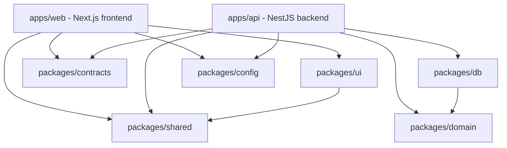

# ToonExpo Ecosystem Dependency Graph

## Runtime Flow

```text
Browser -> apps/web -> HTTPS REST -> apps/api -> packages/db -> PostgreSQL
```

Next.js never skips the NestJS API to reach Prisma or PostgreSQL.

## Allowed Compile-Time Dependencies



## Forbidden Edges

- `apps/web -> packages/db`
- `apps/web -> packages/domain`
- `packages/ui -> packages/db`
- `packages/* -> apps/*`
- `packages/domain -> Next.js | React | NestJS | Prisma`
- one NestJS module importing another module's infrastructure internals

## Enforcement

- Use workspace package `exports` and ESLint import-boundary rules.
- Fail CI when `apps/web` imports Prisma, `packages/db` or backend internals.
- Cross-module imports use public `index.ts`/application APIs only.
- OpenAPI generation and frontend client compatibility run in CI.
- Keep `packages/domain` limited to shared value objects; feature domain rules stay module-local in NestJS.
